# github-profile.sh

Turn your GitHub profile into an animated terminal.

Choose your stats, theme, and animation style. github-profile.sh renders a
standalone SVG and keeps it updated with GitHub Actions — no backend,
database, or tracking.

[](https://github.com/angelabenavente/github-profile-sh/actions/workflows/ci.yml)


## Quick start

Run this from your public GitHub Profile README repository
(`USERNAME/USERNAME`):

```bash
npx github-profile-sh init
```

The wizard asks for stats, theme, animation, and update frequency. It writes
`github-profile-sh.yml` and `.github/workflows/github-profile-sh.yml`.

Add this to your profile `README.md`:

```md

```

Then commit and push. The SVG is generated the next time the workflow runs.
You can trigger it immediately from the Actions tab.

## Examples

These examples use the same fictional profile data. Only the config changes.

### Dark

Default config (`theme: dark`, typing). Existing configs that omit `theme`
keep this look.

```yaml
sections:
  repos: true
  stars: true
  streak: true
  codeChanges: true
  languages: true

theme: dark

animation:
  enabled: true
  mode: typing

update:
  frequency: daily
```

**Result**


### Matrix

```yaml
sections:
  repos: true
  stars: true
  streak: true
  codeChanges: true
  languages: true

theme: matrix

animation:
  enabled: true
  mode: typing

update:
  frequency: daily
```

**Result**


### Ubuntu

Same product, a different palette and animation (`sequential` instead of
typing).

```yaml
sections:
  repos: true
  stars: true
  streak: true
  codeChanges: true
  languages: true

theme: ubuntu

animation:
  enabled: true
  mode: sequential

update:
  frequency: daily
```

**Result**


## Themes

Themes are built-in palettes. The default is `dark`. The CLI writes the
selected theme ID to `github-profile-sh.yml`:

```yaml
theme: ubuntu
```

There is no custom color API. Opening a README does not load themes from
this project.

The gallery below uses the same stats and `animation.mode: none`, so the
palettes are easy to compare.

| Dark                                | Light                                 |
| ----------------------------------- | ------------------------------------- |
| 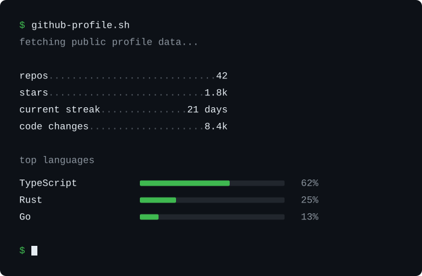 | 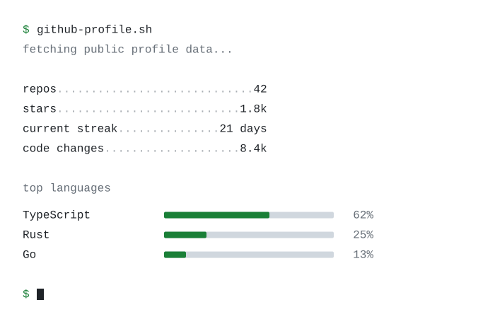 |

| GitHub Dark                                       | Ubuntu                                  |
| ------------------------------------------------- | --------------------------------------- |
| 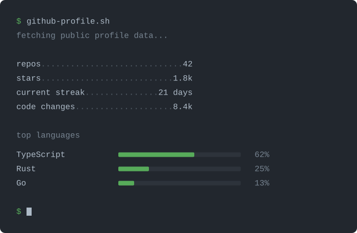 |  |

| macOS                                 | Matrix                                  |
| ------------------------------------- | --------------------------------------- |
|  | 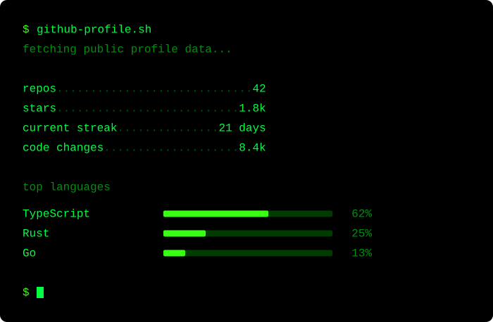 |

| Dracula                                   | Nord                                |
| ----------------------------------------- | ----------------------------------- |
| 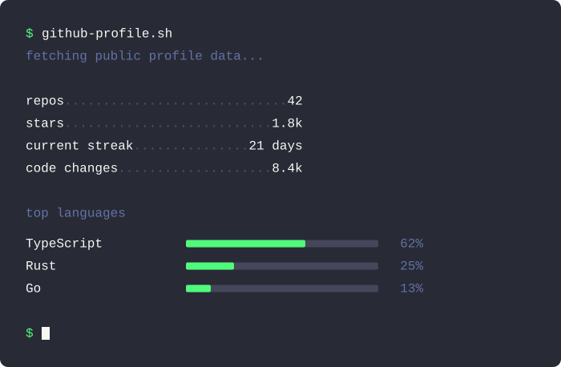 | 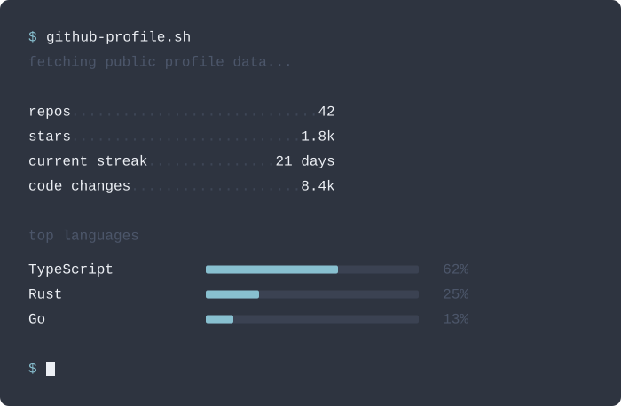 |

| Tokyo Night                                       | Catppuccin                                      |
| ------------------------------------------------- | ----------------------------------------------- |
| 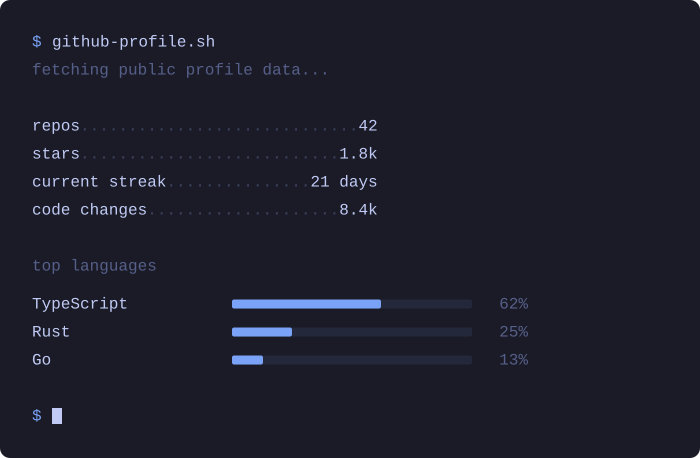 | 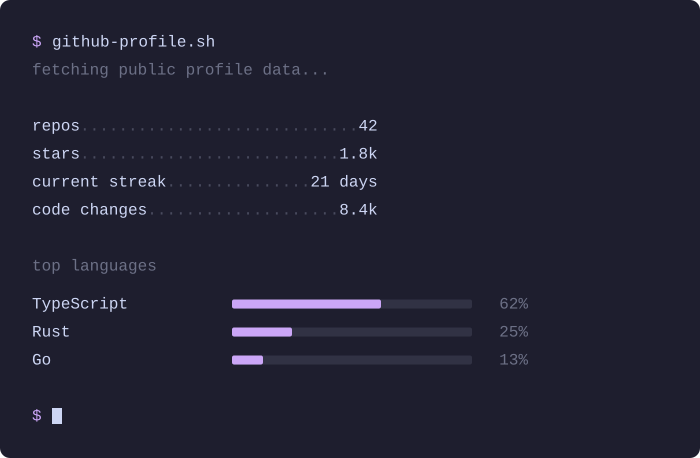 |

| Gruvbox                                   | Monokai                                   |
| ----------------------------------------- | ----------------------------------------- |
| 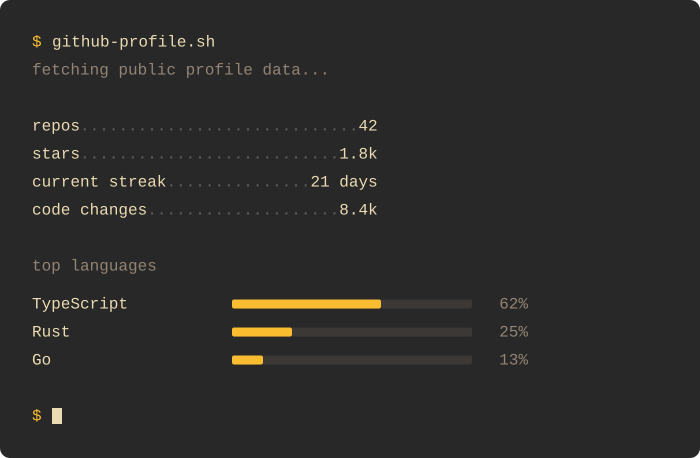 | 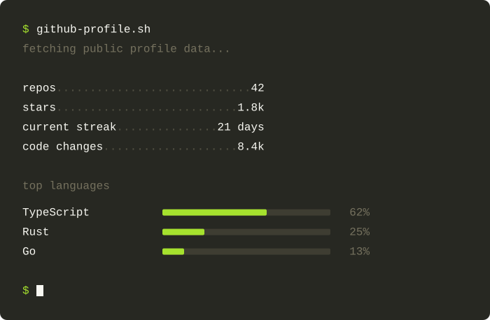 |

| Solarized Dark                                          | Solarized Light                                           |
| ------------------------------------------------------- | --------------------------------------------------------- |
| 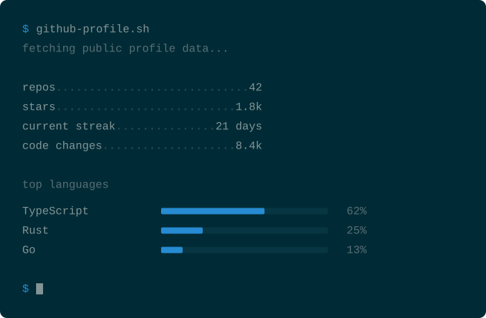 | 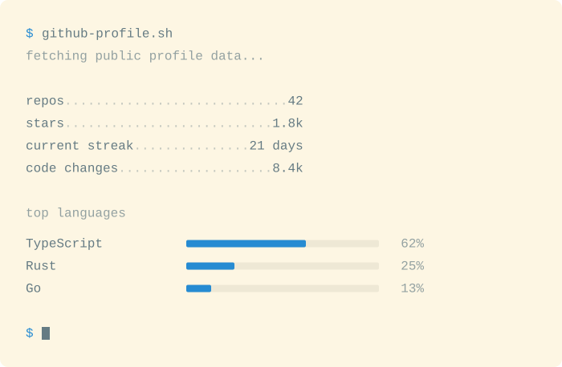 |

| Amber                                 | Retro Green                                       |
| ------------------------------------- | ------------------------------------------------- |
| 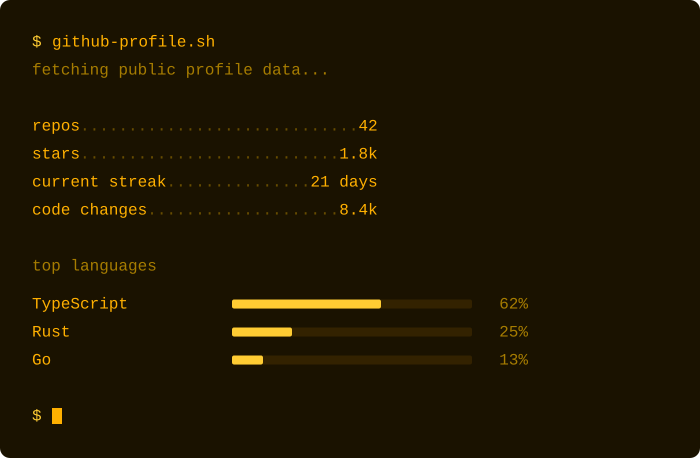 | 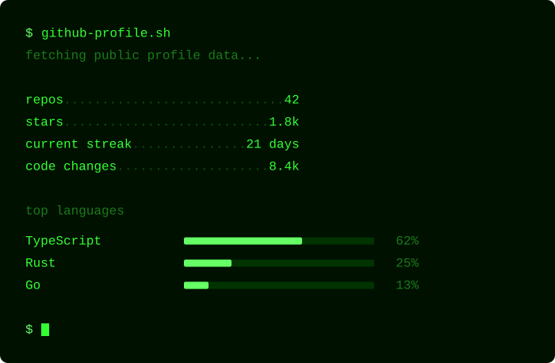 |

### Theme reference

| Theme ID          | Name            |
| ----------------- | --------------- |
| `dark`            | Dark            |
| `light`           | Light           |
| `github-dark`     | GitHub Dark     |
| `ubuntu`          | Ubuntu          |
| `macos`           | macOS           |
| `matrix`          | Matrix          |
| `dracula`         | Dracula         |
| `nord`            | Nord            |
| `tokyo-night`     | Tokyo Night     |
| `catppuccin`      | Catppuccin      |
| `gruvbox`         | Gruvbox         |
| `monokai`         | Monokai         |
| `solarized-dark`  | Solarized Dark  |
| `solarized-light` | Solarized Light |
| `amber`           | Amber           |
| `retro-green`     | Retro Green     |

Names such as Ubuntu, macOS, and GitHub Dark are inspired by familiar
terminals. They are not official or affiliated palettes.

## Configuration

`github-profile-sh.yml` is the source of truth. The checked-in default
sample is `examples/github-profile.yml`.

| Key         | What it controls                                   |
| ----------- | -------------------------------------------------- |
| `sections`  | Which public stats to include                      |
| `theme`     | Built-in palette. Default: `dark`                  |
| `animation` | Playback style (`typing`, `sequential`, or `none`) |
| `update`    | Used by `init` to write the workflow schedule      |

A default file looks like this:

```yaml
sections:
  repos: true
  stars: true
  streak: true
  codeChanges: true
  languages: true

theme: dark

animation:
  enabled: true
  mode: typing

update:
  frequency: daily
```

## Available stats

Any of these public metrics can be included:

- **repos** — public repositories you own
- **stars** — stars across those repositories
- **current streak** — consecutive days with contributions
- **code changes** — additions plus deletions from GitHub contributor stats
- **top languages** — language mix across those repositories

If contributor stats are incomplete for some repositories, code changes is
shown as an approximation (`~8.4k`).

## Animation

- `typing` — types the command, then reveals each line
- `sequential` — reveals the command and lines in order, without typing
- `none` — static terminal (no playback)

`animation.enabled: false` is treated as `none`.

## Update frequency

| Config    | Meaning        |
| --------- | -------------- |
| `12h`     | Every 12 hours |
| `daily`   | Once a day     |
| `weekly`  | Once a week    |
| `monthly` | Once a month   |
| `manual`  | Manual only    |

Every generated workflow includes `workflow_dispatch`, so you can always run
it from the Actions tab.

`update.frequency` is only used by `github-profile-sh init` when it writes
the workflow. The Action does not read it while rendering an SVG.

## Manual GitHub Action setup

If you prefer not to use the CLI, add the same two files yourself. The
generate step is:

```yaml
- name: Generate profile
  uses: angelabenavente/github-profile-sh@v1
  with:
    config: github-profile-sh.yml
    output: github-profile.svg
    token: ${{ github.token }}
```

| Input      | Default                 | Description                                                                            |
| ---------- | ----------------------- | -------------------------------------------------------------------------------------- |
| `config`   | `github-profile-sh.yml` | Path to the config file                                                                |
| `output`   | `github-profile.svg`    | Path of the generated SVG                                                              |
| `token`    | required                | Token used to fetch public profile data                                                |
| `manifest` | optional                | Path to a multi-profile outputs manifest. When set, `config` and `output` are ignored. |

| Output      | Modes            | Description                                                         |
| ----------- | ---------------- | ------------------------------------------------------------------- |
| `svg-path`  | single mode only | Path of the generated SVG                                           |
| `svg-paths` | single and multi | JSON array of generated SVG paths, in the same order as the request |

If `manifest` is set, the Action uses that file and does not read the
`config` or `output` inputs. If `manifest` is omitted, the existing
single-file `config` + `output` mode is unchanged.

Manifest and config paths are resolved from the Action working directory,
the same way `config` and `output` already are. They are not resolved
relative to the directory that contains the manifest.

The workflow generated by `init` also checks out the repo and commits
`github-profile.svg` when it changes.

The Action reads `theme` from the config file. Do not pass a theme input.

## Multiple SVGs

Use multiple SVGs when you want text or other Markdown between different
terminal blocks.

Manifest mode generates all SVGs in one Action run and fetches GitHub data
only once.

`github-profile-sh init` still writes one config and one generate step.
Add the extra files by hand. This repository keeps a generated copy in
`examples/multi-svg/`.

### Example

```md
## Stats


Some text between blocks.

## Languages


```

Ubuntu theme, typing, languages off (`examples/multi-svg/main.yml`):


Matrix theme, sequential, only top languages
(`examples/multi-svg/languages.yml`):


### Manifest

Recommended name: `github-profile-sh.outputs.yml`. Any path works. Each
entry is a normal profile config plus an output path.

```yaml
# github-profile-sh.outputs.yml

profiles:
  - config: github-profile-main.yml
    output: github-profile.svg

  - config: github-profile-languages.yml
    output: github-languages.svg
```

Paths are resolved from the Action working directory, the same way
`config` and `output` already are.

### Workflow

Keep one job. Invoke `angelabenavente/github-profile-sh@v1` once with
`manifest`, then commit both SVG paths explicitly. A complete sample is
`examples/multi-svg/workflow.yml`.

```yaml
- name: Generate profiles
  uses: angelabenavente/github-profile-sh@v1
  with:
    manifest: github-profile-sh.outputs.yml
    token: ${{ github.token }}
```

```yaml
- name: Commit profiles
  run: |
    git add github-profile.svg github-languages.svg
    git diff --cached --quiet || git commit -m "chore(profile): update github stats"
    git push
```

You can also invoke the Action multiple times with different
`config`/`output` pairs, but manifest mode avoids refetching the same
GitHub data for every SVG.

### How it works

```text
github-profile-sh.outputs.yml
        ↓
read every ProfileConfig
        ↓
fetch public GitHub data once
        ↓
render each profile
        ↓
github-profile.svg
github-languages.svg
```

All outputs from one run share the same username, date, and GitHub
snapshot.

### Current limitations

- `github-profile-sh init` still creates a single profile. Multi-output
  is configured by hand.
- Each profile uses its own `ProfileConfig` (`sections`, `theme`,
  `animation`, `update`).
- The workflow has one schedule. `update.frequency` in each config does
  not create extra triggers. The Action ignores that field while
  rendering.
- Outputs from the same run share one GitHub snapshot. That is
  intentional.

## How it works

```text
github-profile-sh.yml
  sections + theme + animation + update
        ↓
GitHub Action
        ↓
public GitHub data
        ↓
terminal renderer
        ↓
github-profile.svg
        ↓
profile README
```

There is no hosted backend. The SVG lives in your repository. GitHub
Actions regenerates it on the schedule you choose. Viewing the README does
not call this project.

## Requirements

- A public [GitHub Profile README](https://docs.github.com/en/account-and-profile/setting-up-and-managing-your-github-profile/customizing-your-profile/managing-your-profile-readme) repository
- GitHub Actions enabled on that repository
- Node.js 24+ only if you run the CLI locally

## Limitations

- Only public profile data is used. Private repositories are not included.
- Repos and stars count every public repository you own, including forks.
- Code changes depends on GitHub contributor statistics. Large repositories
  can return partial data; the value is then prefixed with `~`.
- The SVG is static. It is not regenerated when someone views the README.
- Repeated Action invocations each fetch GitHub data independently.
  Manifest mode fetches once for every SVG in that run.

## Development

```bash
pnpm install
pnpm test:run
pnpm lint
pnpm format:check
pnpm typecheck
```

Rebuild the committed Action bundle after changing Action or core source:

```bash
pnpm build:action
```

Build the publishable CLI bundle:

```bash
pnpm build:cli
```

Regenerate the versioned SVGs and example configs in `examples/`:

```bash
pnpm examples:generate
```

## License

The software is MIT. Generated profile SVGs are CC BY 4.0. See
[LICENSE](./LICENSE).
