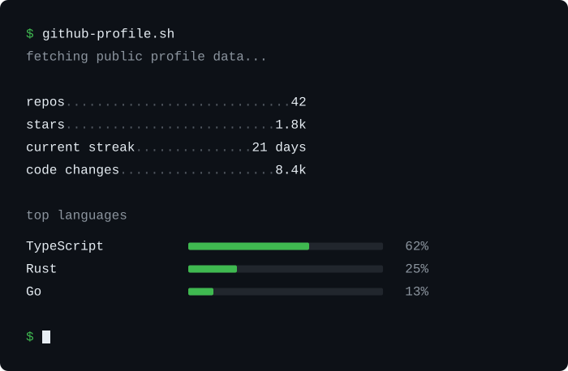

# github-profile.sh

Animated GitHub profile stats rendered as a terminal, powered by GitHub
Actions.

[](https://github.com/angelabenavente/github-profile-sh/actions/workflows/ci.yml)



## What it shows

v0.1 can include any of these public metrics:

- **repos** — public repositories you own
- **stars** — stars across those repositories
- **current streak** — consecutive days with contributions
- **code changes** — additions plus deletions from GitHub contributor stats
- **top languages** — language mix across those repositories

If contributor stats are incomplete for some repositories, code changes is
shown as an approximation (`~8.4k`).

## Install

Run this from your public GitHub Profile README repository
(`USERNAME/USERNAME`):

```bash
npx github-profile-sh init
```

The wizard asks three things: which metrics to show, the animation type, and
how often to update.

It creates:

```text
github-profile-sh.yml
.github/workflows/github-profile-sh.yml
```

Add this to your profile `README.md`:

```md

```

Then commit and push. The SVG is generated the next time the workflow runs.
You can trigger it immediately from the Actions tab.

## How updates work

```text
GitHub Action
  ↓
fetch public data
  ↓
generate static SVG
  ↓
commit only if changed
```

There is no hosted backend. The Action reads public GitHub data, writes
`github-profile.svg` into your repository, and commits it only when the file
changes. Opening the README does not call this project.

## Update frequency

| Config    | Meaning        |
| --------- | -------------- |
| `12h`     | Every 12 hours |
| `daily`   | Once a day     |
| `weekly`  | Once a week    |
| `monthly` | Once a month   |
| `manual`  | Manual only    |

Every generated workflow includes `workflow_dispatch`, so you can always run
it from the Actions tab.

## Configuration

`github-profile-sh.yml` is the source of truth. A default file looks like
this:

```yaml
sections:
  repos: true
  stars: true
  streak: true
  codeChanges: true
  languages: true

theme: dark

animation:
  enabled: true
  mode: typing

update:
  frequency: daily
```

v0.1 ships one theme: `dark`.

### Animation

- `typing` — types the command, then reveals each line
- `sequential` — reveals the command and lines in order, without typing
- `none` — static terminal (no playback)

`animation.enabled: false` is treated as `none`.

## Manual GitHub Action setup

If you prefer not to use the CLI, add the same two files yourself. The
generate step is:

```yaml
- name: Generate profile
  uses: angelabenavente/github-profile-sh@v1
  with:
    config: github-profile-sh.yml
    output: github-profile.svg
    token: ${{ github.token }}
```

| Input    | Default                 | Description                             |
| -------- | ----------------------- | --------------------------------------- |
| `config` | `github-profile-sh.yml` | Path to the config file                 |
| `output` | `github-profile.svg`    | Path of the generated SVG               |
| `token`  | required                | Token used to fetch public profile data |

The workflow generated by `init` also checks out the repo and commits
`github-profile.svg` when it changes.

## Requirements

- A public [GitHub Profile README](https://docs.github.com/en/account-and-profile/setting-up-and-managing-your-github-profile/customizing-your-profile/managing-your-profile-readme) repository
- GitHub Actions enabled on that repository
- Node.js 24+ only if you run the CLI locally

## Limitations

- Only public profile data is used. Private repositories are not included.
- Repos and stars count every public repository you own, including forks.
- Code changes depends on GitHub contributor statistics. Large repositories
  can return partial data; the value is then prefixed with `~`.
- The SVG is static. It is not regenerated when someone views the README.

## Development

```bash
pnpm install
pnpm test:run
pnpm lint
pnpm format:check
pnpm typecheck
```

Rebuild the committed Action bundle after changing Action or core source:

```bash
pnpm build:action
```
